# Test Heading

## Bill Of Materials

Tip: use Gemini or google image to search for shops selling stuff

### Rotating table

Wooden base (multiplex): 400x400x18mm

[4 adjustable feet](https://www.praxis.nl/ijzerwaren/meubelbeslag/meubelpoten-meubelwieltjes/meubelpoten/duraline-meubelpoot-stelvoet-staal-25x8-30mm-geborsteld-nikkel-4-stuks/5139408) 
Ø25x8-30mm or do I have the M10 variant?, yes M10

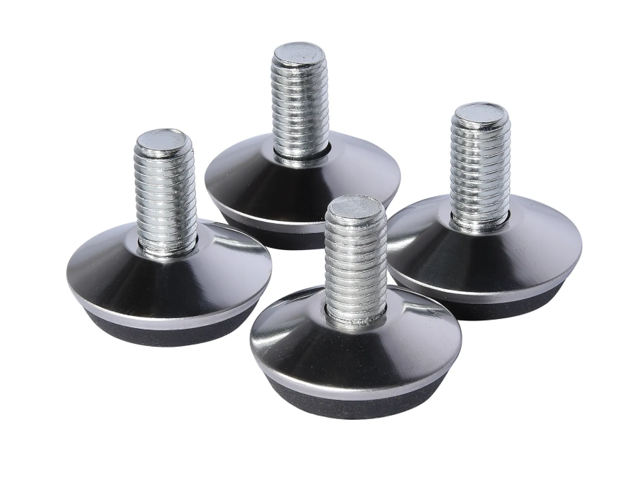

4 feet fix thingies M10 
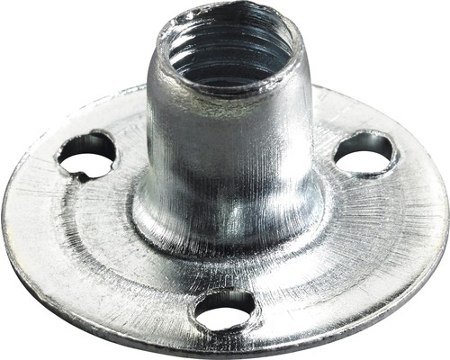
[thingies](https://www.praxis.nl/ijzerwaren/technische-bevestigingsmaterialen/moeren/sleufmoeren/moer-op-plaat-m8-verzinkt-4-stuks/5593972)

12 woodscrews (small)

Swivel raiser (3D printed)
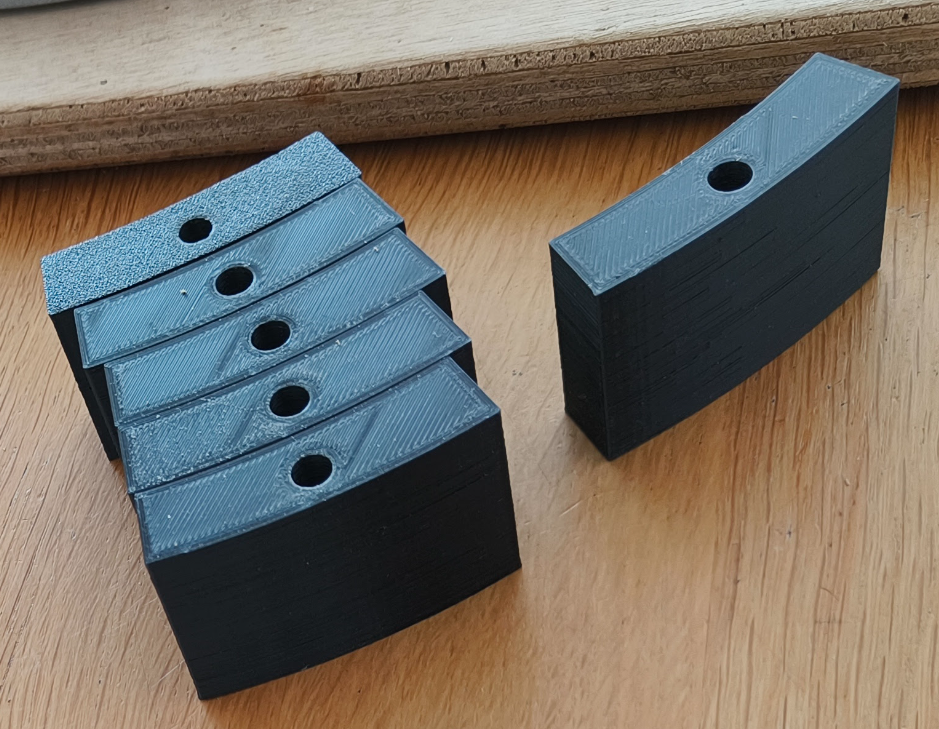


[Gedotec Heavy Duty Swivel Hardware](https://www.amazon.nl/dp/B07YSK27BM/ref=pe_28126711_487102941_TE_SCE_3p_dp_1?th=1), 360° Rotation, Diameter 320 mm, Swivel Plate Made of Steel, Silver, Push Ball Bearings, Load Capacity 300 kg, Swivel Ring for Screwing for Furniture, TV and More

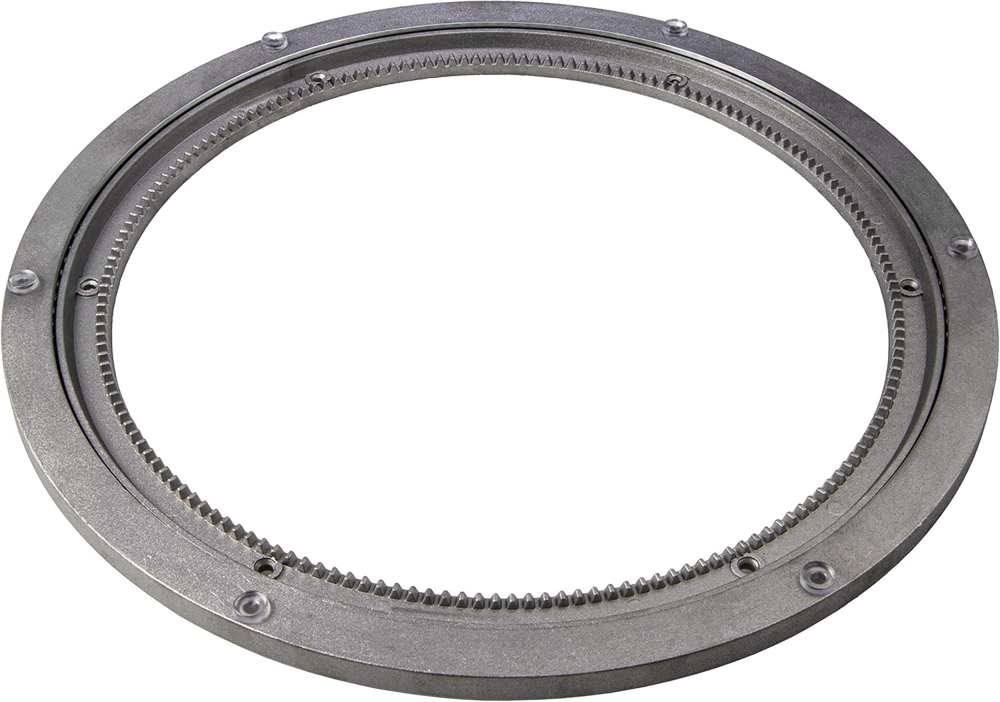

tap holes with M6

6x M6x70 bolt

6x sheet metal ring M6x18x1.6mm

3D printed

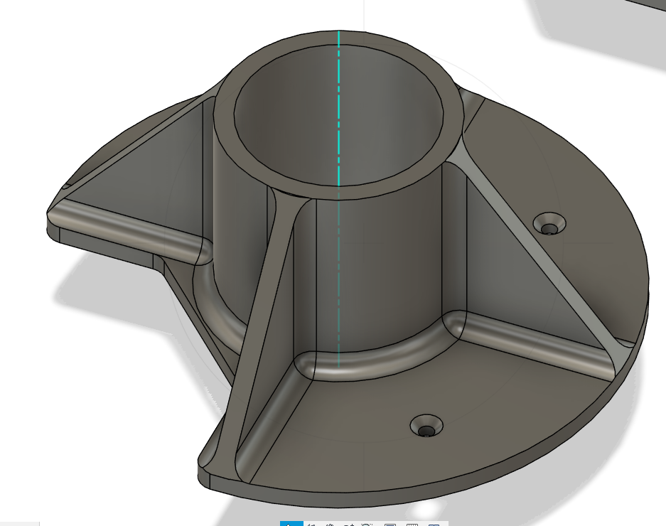

option A
NEMA 23 right angle bracket with holes for NEMA 17
4x 3.5x16mm screw
4x m3x10 sheet metal ring
4x m3x10 bolt

option B
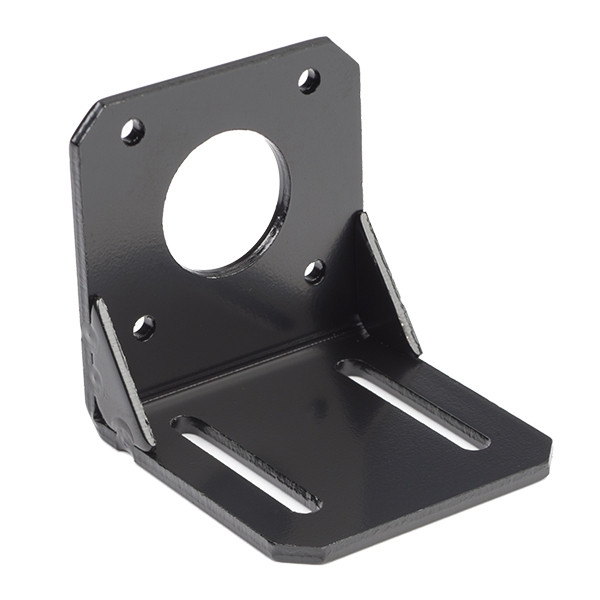
needs a riser

NEMA 17 stepper motor + cable
[17HS4401S](https://nl.aliexpress.com/item/1005008459399126.html?src=google&pdp_npi=4%40dis!EUR!10.26!10.19!!!!!%40!12000045225398666!ppc!!!&src=google&albch=shopping&acnt=272-267-0231&isdl=y&slnk=&plac=&mtctp=&albbt=Google_7_shopping&aff_platform=google&aff_short_key=UneMJZVf&gclsrc=aw.ds&&albagn=888888&&ds_e_adid=&ds_e_matchtype=&ds_e_device=c&ds_e_network=x&ds_e_product_group_id=&ds_e_product_id=nl1005008459399126&ds_e_product_merchant_id=107685546&ds_e_product_country=NL&ds_e_product_language=nl&ds_e_product_channel=online&ds_e_product_store_id=&ds_url_v=2&albcp=20730513328&albag=&isSmbAutoCall=false&needSmbHouyi=false&gad_source=1&gclid=CjwKCAjwnPS-BhBxEiwAZjMF0vMQVTMTSMmwobpDtu7HU1DLKwi0OAbCidpewSs1gNYm2jPjQEHqxhoCbNAQAvD_BwE)

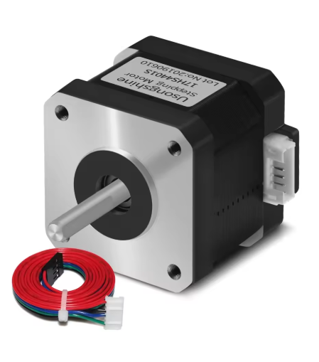

4 small screws (M3x6)

3d printed, not that durable, but at least the aluminum swivel is not damaged. Sprocket can be printed again easily.
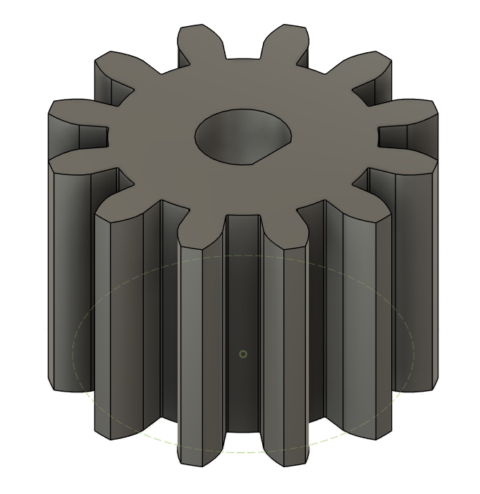


6x screw for top plate: M6x40

top plate multiplex, round 360mm outer diameter, 75 mm inner diameter for speaker stand to pass through

6x top plate stands: 
3D printed
Outer diameter: 15mm
Inner diameter: 6.5mm
height: 22mm
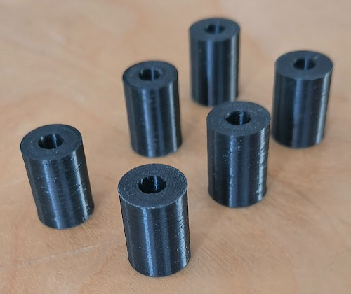

example:
[arduino/esp32duino + cnc shield case](https://www.thingiverse.com/thing:2414345)

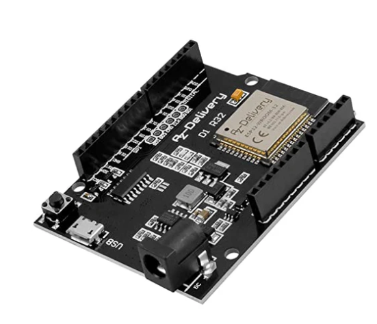
[esp32duino](https://www.az-delivery.de/nl/products/esp32-d1-r32-board)

cnc shield + drivers

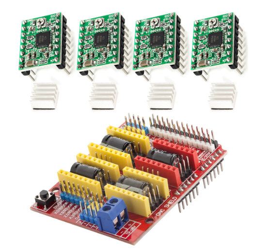
[cncshield](https://www.az-delivery.de/nl/products/cnc-shield-v3-bundle-mit-4-stueck-a4988-schrittmotor-stepper-mit-kuehlkoerper-fuer-arduino-3d-drucker)

2x 10k resistor. Remove resistor R1 for ESP32Duino as can be seen in this [video](https://youtu.be/_uPIW6oP7i4)

some jumpers (3 per cnc shield) to select 1/16 stepping (for a4988 stepper drivers)

### Arm

Aluminium slot profile 2040 V-slot black 1000mm (consider 4040)
[extrusion](https://www.aluxprofile.com/aluminium-slot-profile-2040-v-slot-black/a3958)
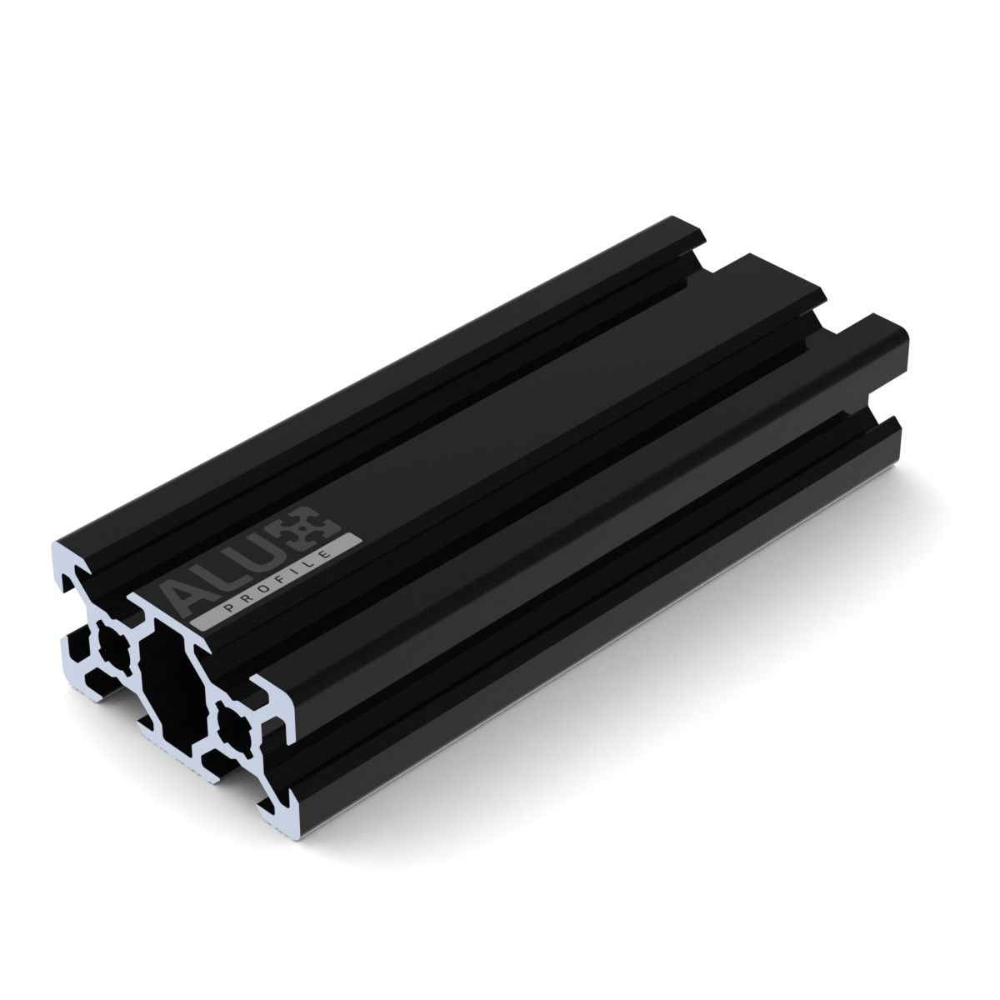

Aluminum slot profile 2040 V-slot black 800mm (could be longer)

Aluminum slot profile 2020 V-slot black 800mm
https://www.aluxprofiel.nl/aluminium-constructieprofiel-2020-v-slot-zwart/a3957


2x Connection plate T 60x60 - 5 holes
[connection plate](https://www.aluxprofile.com/connection-plate-t-60x60-5-holes/a3810)
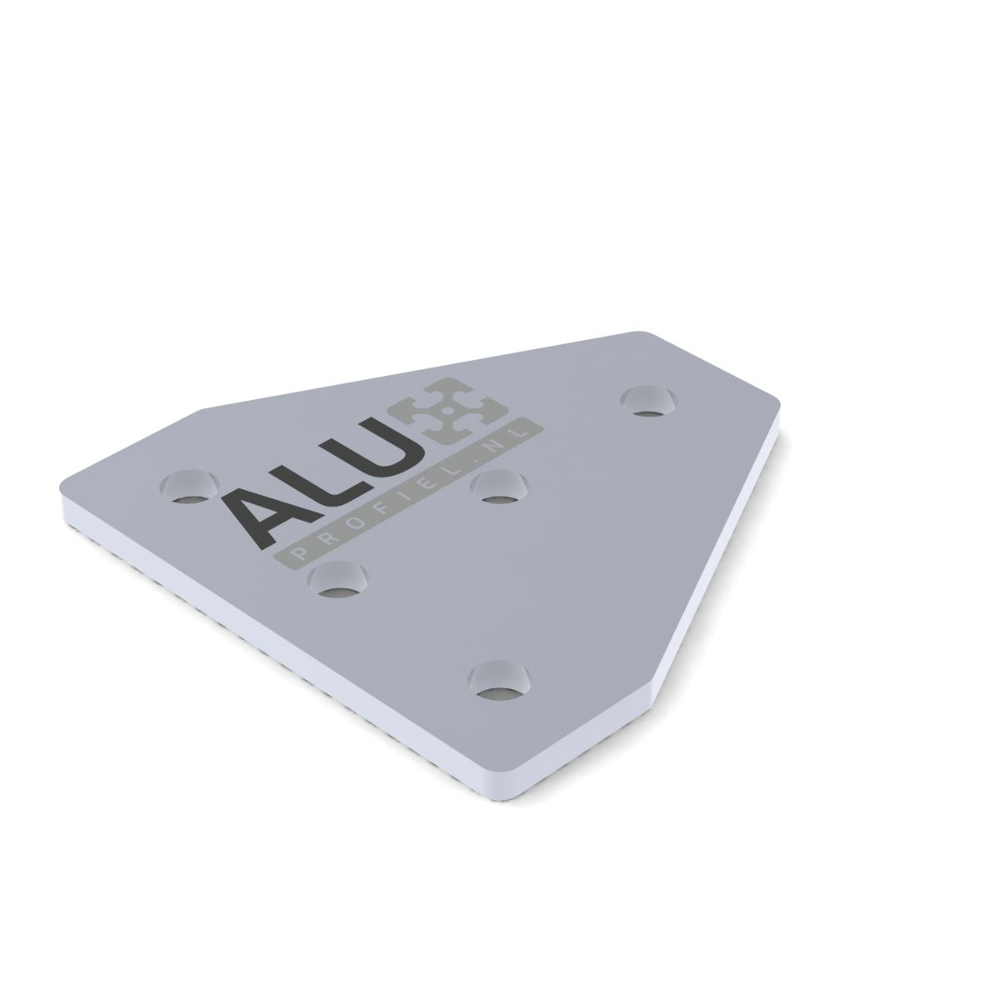

10 schroefjes + 10 t-slot nuts

controller bakje: 2 schroefjes + 2 t-slot nuts

t-slot nuts:
https://www.aluxprofiel.nl/inschuifmoer-t-sleuf-6-m5/a3566

brug dinges

2 bearing
[bearings]([https://elektronicavoorjou.nl/product/608rs-608-2rs-lager?gad_source=1&gclid=Cj0KCQjwv_m-BhC4ARIsAIqNeBv-h9bLgACcuMyumnKoQJKPulJ84CWPedjTcI4_SfAD0zWSPZjhcsgaAiGlEALw_wcB/](https://elektronicavoorjou.nl/product/608rs-608-2rs-lager?gad_source=1&gclid=Cj0KCQjwv_m-BhC4ARIsAIqNeBv-h9bLgACcuMyumnKoQJKPulJ84CWPedjTcI4_SfAD0zWSPZjhcsgaAiGlEALw_wcB/))

klemmetjes GT2 riem

GT2 Pulley - 20 tanden - 5mm as 2x (tinytronics)

GT2 Tandriem - Timing Belt - 6mm - 4m (too much, but always handy) (tinytronics)

moving counterweight

3x v-slot gantry (only 1 plate used for the moving counterweight. Others only the wheels)
[](https://www.aluxprofiel.nl/v-slot-plaat/a4022)
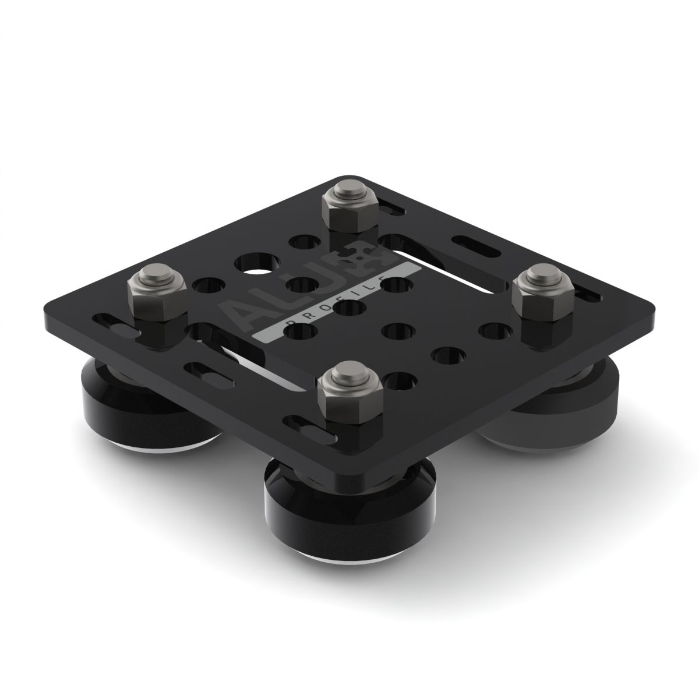

8 bolts (which?) for gantry wheels

8 locking nuts

(3d printed) stepper motor mounting plate. Could also be wood; would probably be sturdier

8 small stepper motor mounting screws 

stationary counterweight

glue clamps to clamp arm and static counterweight to rotating table. These could probably be enough:
https://nl.aliexpress.com/item/1005007693549688.html?src=google&pdp_npi=4%40dis!EUR!1.16!0.69!!!!!%40!12000041871573836!ppc!!!&src=google&albch=shopping&acnt=272-267-0231&isdl=y&slnk=&plac=&mtctp=&albbt=Google_7_shopping&aff_platform=google&aff_short_key=UneMJZVf&gclsrc=aw.ds&&albagn=888888&&ds_e_adid=&ds_e_matchtype=&ds_e_device=c&ds_e_network=x&ds_e_product_group_id=&ds_e_product_id=nl1005007693549688&ds_e_product_merchant_id=107899181&ds_e_product_country=NL&ds_e_product_language=nl&ds_e_product_channel=online&ds_e_product_store_id=&ds_url_v=2&albcp=20730513328&albag=&isSmbAutoCall=false&needSmbHouyi=false&gad_source=1&gclid=Cj0KCQjwv_m-BhC4ARIsAIqNeBs_i6JLEIWEEtMhspL_a3oSN-NBDGCIzUHJz6XNQrABEwiSMtU5wZoaAkyoEALw_wcB
or some other small C clamp.

2x NEMA 17

ESP32duino

cncshield

servo 42d (ordinary drivers are also ok)
https://nl.aliexpress.com/item/1005006294946163.html?spm=a2g0o.order_detail.order_detail_item.2.7a166d76r3BEA7&gatewayAdapt=glo2nld


some v-slot cover plates (3d printed)

plastic pipe for speaker stand

speaker stand top (shape depends on what is needed, flat for bookshelf speaker, arm + hole for Compression Driver + Horn)


some tie wraps

### electronics
Raspberry Pi 5 - 4GB
https://www.kiwi-electronics.com/nl/raspberry-pi-boards-behuizingen-uitbreidingen-en-accessoires-59/raspberry-pi-5-4gb-11579?_gl=1*10sy8r5*_up*MQ..*_gs*MQ..&gclid=Cj0KCQjwv_m-BhC4ARIsAIqNeBtC2uQROaIRlOYEdmYEcv0Zv5nFT9BDxS5y2YOIypPk2r8s-jXQaRMaAlnvEALw_wcB

Heat Sink case for RPi 5 - Passive - Black
https://www.kiwi-electronics.com/nl/raspberry-pi-boards-behuizingen-uitbreidingen-en-accessoires-59/raspberry-pi-behuizingen-68/heat-sink-behuizing-voor-rpi-5-passief-zwart-19949?_gl=1*n3usuh*_up*MQ..*_gs*MQ..&gclid=Cj0KCQjwv_m-BhC4ARIsAIqNeBtC2uQROaIRlOYEdmYEcv0Zv5nFT9BDxS5y2YOIypPk2r8s-jXQaRMaAlnvEALw_wcB

Transcend 128GB microSD met adapter - UHS-I U3 A2 Ultra performance 160/90 MB/s
https://www.kiwi-electronics.com/nl/transcend-128gb-microsd-met-adapter-uhs-i-u3-a2-ultra-performance-160-90-mb-s-11633?search=Transcend%20128GB%20microSD

Raspberry Pi 27W USB-C Power Supply - Zwart - EU
https://www.kiwi-electronics.com/nl/raspberry-pi-boards-behuizingen-uitbreidingen-en-accessoires-59/raspberry-pi-27w-usb-c-power-supply-zwart-eu-11582?_gl=1*10sy8r5*_up*MQ..*_gs*MQ..&gclid=Cj0KCQjwv_m-BhC4ARIsAIqNeBtC2uQROaIRlOYEdmYEcv0Zv5nFT9BDxS5y2YOIypPk2r8s-jXQaRMaAlnvEALw_wcB

TP-Link TL-WR902AC AC750 WLAN Nano Router 
https://www.amazon.nl/dp/B01MY5JIJ0?ref_=pe_28126711_487767311_302_E_DDE_dt_1&th=1

microphone

microphone to alu extrusion adapter (3d printed)
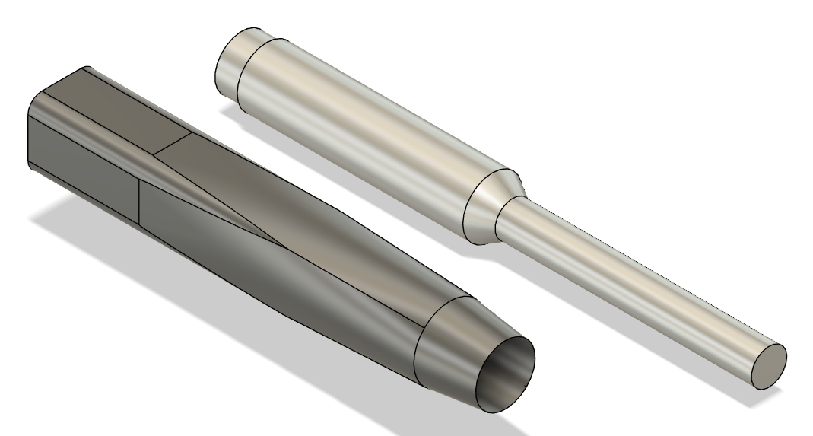


microphone cable

USB DAC (Behringer UMC204HD)
https://www.behringer.com/product.html?modelCode=0805-AAS

amplifier (Aiyima a07)
https://www.aiyima.com/products/aiyima-a07-eu-warehouse-ship?srsltid=AfmBOoq8qIFvJCnA60wGt-F_JHTLbPQswsgIwbVD1DBKiH7k4g5FIfLP

amplifier power supply

RCA cable

DC power supply (20V) for servo motors


# Build description

## Rotation Table

## Motion Controllers

config can be found [here](https://gitlab.com/pan-tilt-slider/pants/-/blob/main/fluidncConfigFile/config.yaml)

TODO motion direction...


## Arm

## Raspberry Pi

NFS (python code) is cloned into ~/NFS

Start (python) virtual environment

```
source venv/bin/activate
```

Start NFS app
```
python nfs_app.py&
```

N.B. the '&' at the end of the command keeps it running after the terminal has closed.


Go to the website: http://192.168.0.103:8086/

N.B. The port number (8086) has to be the same as in the nfs_app.py file.
This is not always closing properly and then you have to alter the port in the nfs_app.py, e.g. add 1,
and point you browser to that new port.

If you want to get a feel for what is happening, open a new terminal
(e.g. using putty) on the nfs raspberry pi and type:

```
tail -f ~/NFS/scanner.log
```

Stop scanner

```
ps nfs
```

look for the PID of python nfs_app.py

```
kill {PIDNUMBER}
``` 

### login
Username: tom
Password: ********

## Wifi network

SSID : NearFieldScanner


