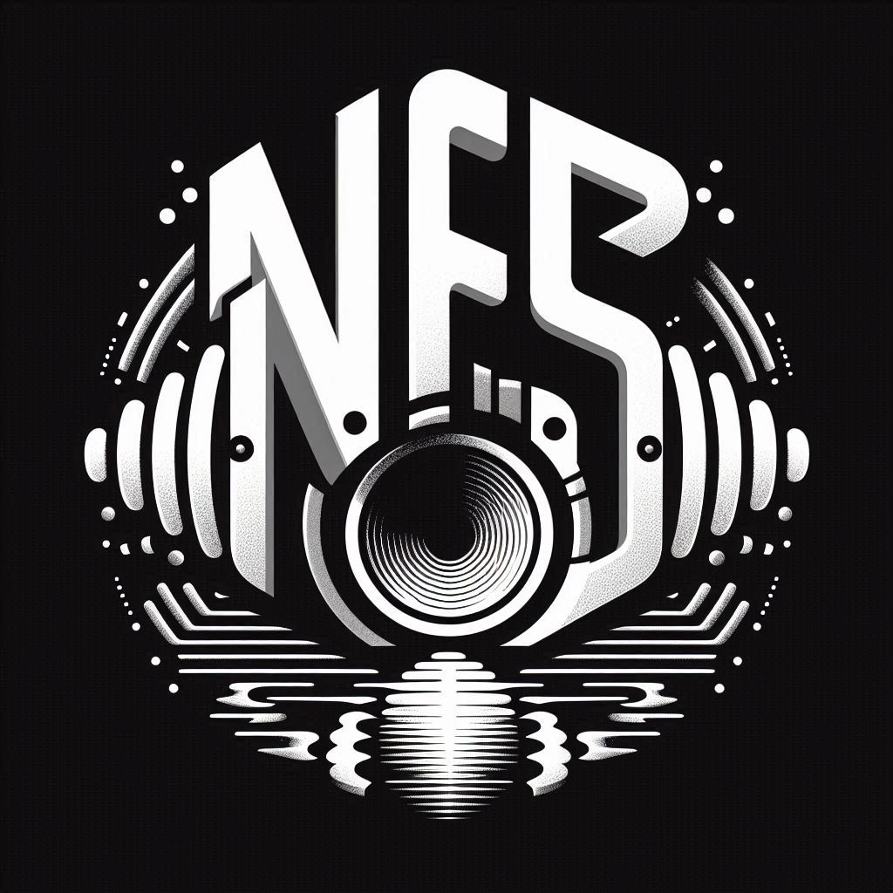

# NFS — Near Field Scanner

<p align="center">
  
</p>

A Python-based **Near Field Scanner** for automated acoustic impulse response measurements. The system orchestrates a 3-axis CNC rig (typically GRBL or FluidNC based) 
to position a microphone around an acoustic source (e.g., a loudspeaker) while precisely synchronizing audio playback and capture.

The scanner supports multiple coordinate systems and scanning patterns through a flexible plugin architecture, making it suitable for both cylindrical and spherical near-field measurements.

> **History:** The initial implementation was written in Octave. Although it worked well as a proof-of-concept, Python proved to be a more versatile platform for hardware control, signal processing, and extensibility.

---

## ✨ Features

- **Automated scanning** — define a set of measurement positions and let the scanner work through them unattended.
- **Cylindrical & spherical grids** — built-in plugins for cylindrical, spherical, arc-based, and file-based measurement point generation.
- **Impulse response capture** — uses exponential sweep excitation with [pyfar](https://pyfar.org/) for high-quality IR measurements.
- **GRBL / FluidNC motion control** — communicates with Arduino or ESP32-based CNC controllers over serial.
- **DSP Backend** — Includes deconvolution of sweeps, time-alignment based on loopback markers, and windowing.
- **Pluggable architecture** — measurement-point generators are loaded as plugins; easy to add your own.
- **Configurable via INI file** — all hardware, audio, and motion parameters live in a single `config.ini`.
- **Mock Mode** — test your measurement sequences without hardware using the built-in mock interfaces for both motion and audio.

---

## 📂 Project Structure

```text
NFS/
├── config.ini          # Main application configuration
├── images/             # Documentation images
├── src/
│   └── nfs/            # Main package
│       ├── audio.py           # Audio capture and DSP (sweep, deconvolution, alignment)
│       ├── datatypes.py       # Shared data structures (CylindricalPosition, etc.)
│       ├── factory.py         # Plugin and component factories
│       ├── grbl_controller.py # Interface to GRBL/FluidNC hardware
│       ├── loader.py          # Dynamic plugin loader
│       ├── motion_manager.py  # High-level motion orchestration (cylindrical/spherical)
│       ├── nfs.py             # Main NearFieldScanner orchestration logic
│       ├── scanner.py         # Low-level CNC axis control
│       └── plugins/           # Measurement point generator plugins
└── tests/              # Comprehensive test suite
```


---

## 🚀 Getting Started

### Prerequisites

| Requirement | Details |
|---|---|
| **Python** | 3.13.5 |
| **uv** | Package manager ([install guide](https://docs.astral.sh/uv/getting-started/installation/)) |
| **Hardware** | A GRBL/FluidNC-controlled CNC frame with at least two linear axes and one rotational axis, plus an audio interface |

### Installation

Clone the repository
```
git clone https://github.com/TomKamphuys/NFS.git
cd NFS
```
Install dependencies (including dev tools)
```
uv sync --all-groups
```


### Configuration

Edit `config.ini` to match your hardware setup. The application uses a modular configuration system where different sections handle different components.

#### Key Configuration Sections:

| Section | Key | Description |
|---|---|---|
| `[nfs]` | `audio`, `plugins`, `motion_manager` | References to the configuration sections for each component. |
| `[scanner]` | `controller`, `feed_rate` | CNC controller type and global feed rate (mm/min). |
| `[grbl_streamer]` | `type`, `port` (via `[windows]`) | GRBL hardware type (e.g., Arduino) and COM port. |
| `[grbl_x/y/z_axis]` | `steps_per_millimeter`, `maximum_rate`, `acceleration` | Low-level GRBL parameters per axis. |
| `[audio]` | `mock`, `device_id`, `measurement_sweeps` | `mock=True` enables simulation. `device_id` is the soundcard index. |
| `[sweep]` | `duration`, `minimum_frequency`, `maximum_frequency` | Exponential sweep parameters for measurements. |
| `[motion_manager]` | `type`, `safe_radius` | High-level motion logic (e.g., `CylindricalMeasurementMotionManager`). |
| `[measurement_points]` | `type`, `filename` | The plugin to use for generating points (e.g., `FileMeasurementPoints`). |

### Running

Run the application with the default configuration:
```bash
uv run nfs-app
```

The application will start the scanning process as defined in `config.ini`. By default, it uses the `FileMeasurementPoints` plugin, which reads from `scan_path.csv` (as configured).
Measurement results (impulse responses) are saved as `.wav` files with metadata including their cylindrical coordinates.
A log of all measurement positions is saved to `measurement_positions.txt`.


---

## 🧪 Testing

```
uv run pytest
```

---

## 🔌 Plugins

Measurement-point generators are loaded dynamically from `src/nfs/plugins/`. The following are included:

| Plugin | Description |
|---|---|
| `cylindrical_measurement_points` | Regular cylindrical grid |
| `spherical_measurement_points` | Regular spherical grid |
| `spherical_measurement_points_sorted` | Spherical grid, sorted for minimal travel |
| `spherical_measurement_points_arcs` | Spherical grid using arc moves |
| `spherical_measurement_points_arcs_random` | Spherical grid with randomised arc ordering |
| `file_measurement_points` | Load positions from a CSV file |

To add a custom plugin, create a new module in `src/nfs/plugins/` that implements the `MeasurementPoints` protocol (see `src/nfs/measurement_points.py`) and 
include a `register` function. Then, register it in `config.ini` under the `[plugins]` section.

### Example Plugin Structure
```python
from nfs.datatypes import CylindricalPosition

class MyCustomPoints:
    def __init__(self, some_param):
        self.some_param = some_param
        self._ready = False

    def next(self) -> CylindricalPosition:
        # Calculate and return next position
        return CylindricalPosition(r=100, t=45, z=50)

    def ready(self) -> bool:
        return self._ready

    def reset(self) -> None:
        pass

def register(factory) -> None:
    factory.register("MyCustomPoints", MyCustomPoints)
```

---

## 🏗️ Hardware 

N.B. A new and improved setup has been designed and built. Please see DiyAudio thread for more details.


---

## 🤝 Contributing

Contributions are welcome! Please feel free to submit a Pull Request. For major changes, please open an issue first to discuss what you would like to change.

1. Fork the Project
2. Create your Feature Branch (`git checkout -b feature/AmazingFeature`)
3. Commit your Changes (`git commit -m 'Add some AmazingFeature'`)
4. Push to the Branch (`git push origin feature/AmazingFeature`)
5. Open a Pull Request

---

## 📄 License

Proprietary — see `pyproject.toml` for details.
All rights reserved.


