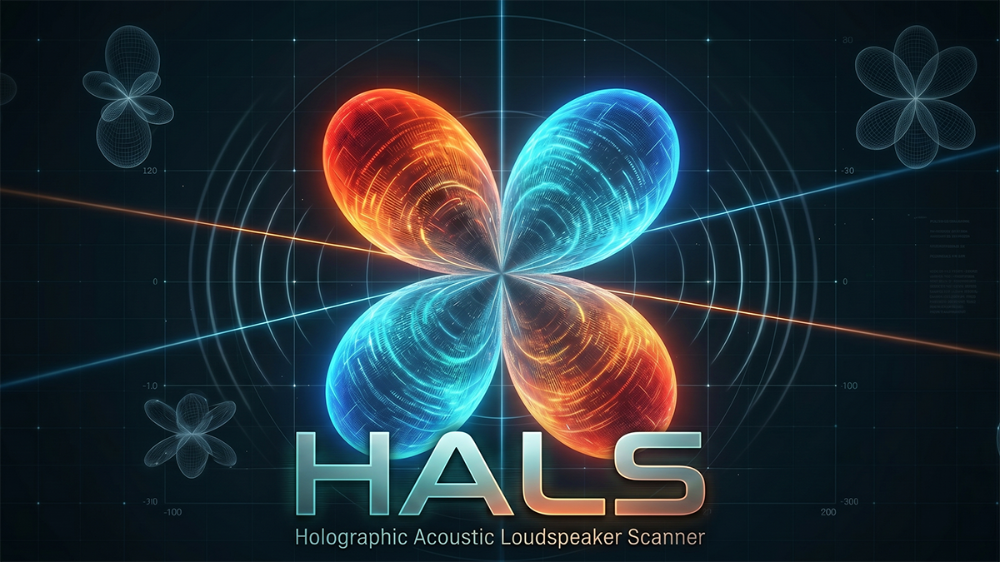

# HALS — Holographic Acoustic Loudspeaker Scanner

<p align="center">
  
</p>

A Python-based **Near Field Scanner** for automated acoustic impulse response measurements. The system orchestrates a 3-axis CNC rig (GRBLHAL based) 
to position a microphone around an acoustic source (e.g., a loudspeaker) while precisely synchronizing audio playback and capture.

The scanner supports multiple coordinate systems and scanning patterns through a flexible plugin architecture, making it suitable for both cylindrical and spherical near-field measurements.

Everything is driven from a bundled native desktop application, which is now included directly in this repository. All hardware, audio, and motion parameters are configured through the graphical interface; there is no need to edit files by hand. See the [HarmonicDrive User Guide](#harmonicdrive-user-guide) section below for a detailed walkthrough.

> **History:** The initial implementation was written in Octave. Although it worked well as a proof-of-concept, Python proved to be a more versatile platform for hardware control, signal processing, and extensibility. The GUI was previously maintained in a separate HarmonicDrive repository; it has since been rewritten as a native Qt (PySide6) desktop application and merged into this project. The old HarmonicDrive repository is no longer used.

---

## ✨ Features

- **Automated scanning** — define a set of measurement positions and let the scanner work through them unattended.
- **Native desktop GUI** — a bundled PySide6 (Qt) application for machine control, audio setup, grid generation, live capture, and configuration.
- **GUI-based configuration** — all hardware, audio, and motion parameters are edited through the in-app **Settings** dialog and **Audio Setup** pane. Settings are stored per project, so no manual file editing is required.
- **Project workspaces** — organize each measurement session in its own project folder holding configuration, grids, and recordings.
- **Real-time progress monitoring** — stay informed with point-by-point updates logged and displayed during long-running scans.
- **Cylindrical & spherical grids** — built-in plugins for cylindrical, spherical, arc-based, and file-based measurement point generation.
- **Impulse response capture** — uses an in-project exponential sine sweep engine with loopback-marker alignment and FFT deconvolution for high-quality IR measurements.
- **GRBL / FluidNC motion control** — communicates with Arduino or ESP32-based CNC controllers over serial.
- **DSP backend** — custom sweep generation, Barker-code loopback alignment, multi-sweep averaging, FFT deconvolution, driver-protection filtering, linear/distortion IR separation, and windowing.
- **DSP verification tooling** — automated real-time verification of measurement quality, including SNR estimation, THD calculation, and alignment Peak Sharpness Ratio (PSR) monitoring.
- **Pluggable architecture** — measurement-point generators are loaded as plugins; easy to add your own.
- **Mock mode** — test your measurement sequences without hardware using the built-in mock interfaces for both motion and audio.

---

## 📂 Project Structure

```text
NFS/
├── config.ini              # Default configuration (managed through the GUI)
├── images/                 # Documentation images
├── src/
│   ├── harmonic_drive_qt/  # Native Qt (PySide6) desktop GUI — HarmonicDrive
│   │   ├── main.py               # GUI entry point (harmonic-drive-qt)
│   │   ├── main_window.py        # Main window and view navigation
│   │   ├── control_pane.py       # Machine control (jog, home, measure)
│   │   ├── audio_setup_pane.py   # Audio device / channel setup
│   │   ├── grid_pane.py          # Grid generator
│   │   ├── live_capture.py       # Live plots during measurement
│   │   ├── settings_dialog.py    # Configuration editor
│   │   └── backend.py            # Bridge to the core scanner library
│   ├── grid_generator/     # Grid generation helpers and assets
│   └── nfs/                # Core Library
│       ├── audio.py              # Audio capture and DSP
│       ├── datatypes.py          # Shared data structures
│       ├── factory.py            # Plugin and component factories
│       ├── grbl_controller.py    # Interface to GRBL hardware
│       ├── loader.py             # Dynamic plugin loader
│       ├── motion_manager.py     # High-level motion orchestration
│       ├── nfs.py                # Main NearFieldScanner logic
│       ├── scanner.py            # Low-level CNC axis control
│       └── plugins/              # Measurement point generator plugins
└── tests/                  # Comprehensive test suite
```


---

## 🚀 Getting Started

### Prerequisites

| Requirement | Details |
|---|---|
| **Python** | 3.13.5 |
| **uv** | Package manager ([install guide](https://docs.astral.sh/uv/getting-started/installation/)) |
| **Hardware** | A GRBL/FluidNC-controlled CNC frame with at least two linear axes and one rotational axis, plus an audio interface |

### Installation

Clone the repository
```
git clone https://github.com/TomKamphuys/NFS.git
cd NFS
```

Install dependencies (including dev tools)
```
uv sync --all-groups
```

or without dev tools
```
uv sync --no-dev
```

### Launch the application
```bash
uv run harmonic-drive-qt
```
This opens the HarmonicDrive desktop window. On first launch you will be prompted to review the audio and scanner settings. All configuration is done from within the GUI — see the [HarmonicDrive User Guide](#harmonicdrive-user-guide) below.

You can optionally point the app at a specific configuration file:
```bash
uv run harmonic-drive-qt --config path\to\config.ini
```


## Use PyCharm (currently mostly used as development is still causing rapid changes)

Welcome to PyCharm! Integrating `uv` into your workflow is a great choice for fast, reliable dependency management. Since you’ve already installed PyCharm, here is the most efficient, step-by-step path to cloning your repository and setting up your environment.

---

### Step 1: Clone Your Repository
1.  Open **PyCharm**.
2.  On the Welcome screen, select **Get from VCS** (Version Control System). If you are already inside a project, go to the top menu: `File` > `New` > `Project from Version Control...`.
3.  Paste your GitHub repository URL into the **URL** field.
4.  Choose the local folder where you want to save the project and click **Clone**.
5.  PyCharm will ask if you want to open the project in the current window or a new one; select the option that best fits your preference.

### Step 2: Initialize the Environment with `uv`
Once the project is open, you need to ensure your dependencies are installed. PyCharm often detects `pyproject.toml` files, but using `uv` directly in the terminal is the most reliable way to sync your environment.

1.  Open the **Terminal** tab at the bottom of the PyCharm window (`Alt+F12` on Windows/Linux or `Option+F12` on macOS).
2.  Run the following command:
    ```bash
    uv sync
    ```
    * **Why?** This command reads your `uv.lock` file and creates or updates a `.venv` folder in your project directory with all the exact package versions required.

### Step 3: Configure the Interpreter in PyCharm
After `uv sync` finishes, you need to tell PyCharm to use that environment as the "Python Interpreter" so it can provide code completion, error checking, and debugging.

1.  Open **Settings** (`Ctrl+Alt+S` or `Cmd+,` on macOS).
2.  Navigate to **Project: [Your Project Name]** > **Python Interpreter**.
3.  Click the **Add Interpreter** link (or the gear icon) and select **Add Local Interpreter...**.
4.  In the dialog:
    * Select **Virtualenv Environment** on the left.
    * Select **Existing environment**.
    * Click the `...` button and browse to the `.venv` folder that `uv sync` created in your project directory.
    * Select the `python` executable inside the `bin` (or `Scripts` on Windows) folder of that `.venv`.
5.  Click **OK** to apply the changes.

---

### Pro-Tips for `uv` + PyCharm
* **Automatic Detection:** Newer versions of PyCharm may automatically prompt you to "Create a uv environment" as soon as you open the project. If you see this notification in the bottom-right corner or at the top of the editor, click it! It will handle the syncing and interpreter configuration for you.
* **Running the app:** Once the interpreter is set, you can add a run configuration for the `harmonic-drive-qt` script, or simply run `uv run harmonic-drive-qt` from the terminal.
* **Managing Dependencies:** If you need to add a new package later, don't just run `pip install`. Use the terminal to keep your lockfile updated:
    ```bash
    uv add <package_name>
    ```
    PyCharm will automatically detect that the environment has changed and update its index.


## 📚 Documentation

The project uses Sphinx to automatically generate API documentation from docstrings.

### Building Locally
To build the HTML documentation locally, run:
```bash
uv run sphinx-build -b html docs docs/_build/html
```
The output will be available in `docs/_build/html/index.html`.

### Online Documentation
Documentation is automatically built and deployed to GitHub Pages on every push to the `master` branch.

---

## 🧪 Testing

Run the standard test suite:
```bash
uv run pytest
```

### Full System Mock Integration Test
A specialized integration test is available that simulates a complete measurement run using mock hardware (both audio and motion). This verifies the entire orchestration logic from plugin loading to final position logging.

```bash
uv run pytest tests/test_full_system_mock.py
```

### DSP Verification Tests
Run the dedicated DSP verification tests to validate the automated quality metrics (SNR, THD, PSR).

```bash
uv run pytest tests/test_dsp_verification.py
```

---

## 🔌 Plugins

Measurement-point generators are loaded dynamically from `src/nfs/plugins/`. The following are included:

| Plugin | Description |
|---|---|
| `cylindrical_measurement_points` | Regular cylindrical grid |
| `spherical_measurement_points` | Regular spherical grid |
| `spherical_measurement_points_sorted` | Spherical grid, sorted for minimal travel |
| `spherical_measurement_points_arcs` | Spherical grid using arc moves |
| `spherical_measurement_points_arcs_random` | Spherical grid with randomised arc ordering |
| `file_measurement_points` | Load positions from a CSV file |

To add a custom plugin, create a new module in `src/nfs/plugins/` that implements the `MeasurementPoints` protocol (see `src/nfs/measurement_points.py`) and 
include a `register` function. The available generators and their parameters can then be selected and configured from the **Settings** dialog in the GUI.

### Example Plugin Structure
```python
from nfs.datatypes import CylindricalPosition

class MyCustomPoints:
    def __init__(self, some_param):
        self.some_param = some_param
        self._ready = False

    def next(self) -> CylindricalPosition:
        # Calculate and return next position
        return CylindricalPosition(r=100, t=45, z=50)

    def ready(self) -> bool:
        return self._ready

    def reset(self) -> None:
        pass

def register(factory) -> None:
    factory.register("MyCustomPoints", MyCustomPoints)
```

---

## 🏗️ Hardware 

N.B. A new and improved setup has been designed and built. Please see the DiyAudio thread for more details.


---

## 🤝 Contributing

Contributions are welcome! Please feel free to submit a Pull Request. For major changes, please open an issue first to discuss what you would like to change.

1. Fork the Project
2. Create your Feature Branch (`git checkout -b feature/AmazingFeature`)
3. Commit your Changes (`git commit -m 'Add some AmazingFeature'`)
4. Push to the Branch (`git push origin feature/AmazingFeature`)
5. Open a Pull Request

---

## 📄 License

Proprietary — see `pyproject.toml` for details.
All rights reserved.


# HarmonicDrive User Guide

HarmonicDrive is the bundled native desktop controller for the near-field acoustic scanner. It automates loudspeaker 
measurements by moving a microphone along predefined grids (e.g. cylindrical or spherical) using a 3-axis CNC-style turntable/arm. 
It is a Qt (PySide6) application that is now included directly in this repository — no separate installation is required.

---

## 1. Getting Started

### Prerequisites
1.  The GRBL settings have been set correctly using external tooling (e.g. IOSender).
2.  An audio interface with at least one input and one output channel is connected.

### Installation & Launch
1.  **Clone Repository**:
    ```bash
    git clone https://github.com/TomKamphuys/NFS.git
    cd NFS
    ```
2.  **Sync Dependencies**: Use `uv` to manage the environment.
    ```bash
    uv sync --all-groups
    ```
3.  **Launch the application**:
    ```bash
    uv run harmonic-drive-qt
    ```
    The HarmonicDrive desktop window opens. If any required audio or scanner settings are missing, the app will warn you and open the relevant configuration view automatically.

---

## 2. Configuration (via the GUI)

All configuration is performed inside the application; you do not need to edit any files manually. Settings are persisted automatically and stored with the active project.

### Settings dialog
Open **Settings** from the left-hand menu to edit hardware, motion, and audio parameters, grouped into tabs:

- **Scanner** — motion controller type (e.g. `grbl_streamer`) and global feed rate (mm/min).
- **Motion manager** — motion logic (e.g. cylindrical or spherical), the referenced measurement grid, and the safe radius used to prevent collisions.
- **Measurement points** — choose the grid generator plugin and edit its parameters directly in the dialog.
- **Audio & sweep** — sample rate, sweep duration and level, number of sweeps to average, silence padding, tail taper, driver-protection high-pass filter, marker alignment, and the recording naming convention.
- **App / logging** — interface preferences and logging level.

Use **Restore Defaults** in the dialog to reset a section to the shipped defaults. Click **Apply / Save** to persist changes; the affected views are rebuilt automatically.

### Audio Setup pane
The **Audio Setup** view provides a dedicated screen for selecting the audio API, input/output devices, and the microphone, loopback, speaker, and reference channels. This is the first place to visit if you see an audio-related startup warning.

### Projects
HarmonicDrive works with **projects** — each project is a folder that stores its own configuration, generated grids, and recordings. Use the project controls to browse to or create a session folder; the current project path is shown in the window. When no folder is selected the app uses a temporary working project.

---

## 3. The Interface

The main window has a collapsible **Views** menu on the left with the following screens:

- **Audio Setup** — configure the audio interface and channels.
- **Grid Generator** — create and preview measurement grids.
- **Machine Control** — jog the axes, home the machine, and start measurements.
- **Live Capture** — real-time plots of measurement progress, positions, frequency response, and impulse response.
- **Settings** — the configuration dialog described above.
- **Shutdown Program** — closes the application.

### Machine Control
- **Jog controls** — move the **PHI** (rotation), **R** (radius), and **Z** (height) axes using the labelled step buttons.
- **Home / Rehome** — run or force the hardware homing sequence.
- **Clear Alarm / Soft Reset** — recover the GRBL controller from an alarm state.
- **Hold / Stop** — immediately pause or halt motion.
- **Height offset / Zero NFS** — set the reference point of the coordinate system on the speaker's acoustic center.
- **Start measurements / Take single measurement** — begin the automated scan or capture a single sweep at the current position.

### Live Displays
- **Position dials** — real-time readout of Radius (R), Phi (P), and Height (Z).
- **Status** — current machine state (Idle, Run, Alarm, etc.).
- **Live capture plots** — measurement progress, measured positions, frequency response, and impulse response.
- **Log view** — real-time system events and errors.

---

## 4. Recommended Workflow

Follow these steps for a successful measurement session:

1.  **Hardware Prep**: Mount the speaker on the turntable and the microphone on the arm, and make sure everything is properly aligned.
2.  **Select / Create a Project**: Choose a session folder so configuration, grids, and recordings are kept together.
3.  **Configure Audio**: Open **Audio Setup** and select the interface, devices, and channels. Verify the settings in **Settings → Audio & sweep**.
4.  **Generate a Grid**: Use the **Grid Generator** to define your measurement points, or select an existing grid in **Settings**.
5.  **Home the System**: In **Machine Control**, click **HOME** and wait for the machine to reach the `IDLE` state.
6.  **Set Reference**:
    - Use the jog buttons to align the microphone with the zero-triangle.
    - Enter the **Height Offset** and click **Zero NFS**. The coordinate system now centers on your speaker.
7.  **Run Scan**:
    - Click **Start measurements**.
    - Monitor **Live Capture** and the **Log View** to ensure measurements are proceeding as expected.
    - WAV files are saved to the project's recordings folder automatically, with the time and date encoded in the directory.

---

## 5. Troubleshooting

- **Machine in ALARM**: Usually caused by hitting a limit switch or a hard stop. Click **Clear Alarm**. If it persists, use **Soft Reset**.
- **Audio Errors**: Open the **Audio Setup** view and confirm the API, devices, and channels are correct for your interface.
- **Unexpected Movement**: Verify the steps-per-millimeter and feed rate in **Settings**, and check whether the axes are reversed in the GRBL settings.
- **Startup warnings**: On launch the app may open **Audio Setup** or **Settings** if required parameters are missing — review and save the highlighted section.
