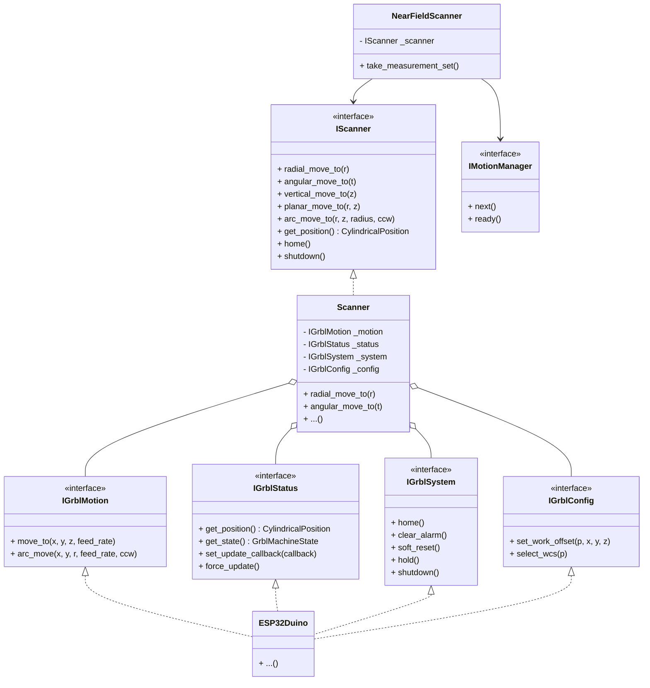
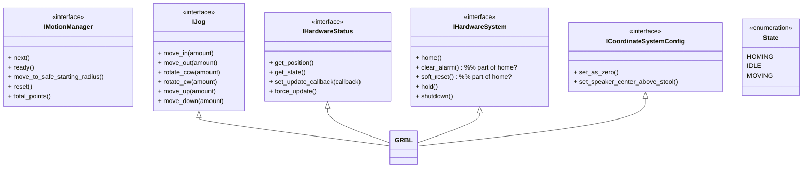

```mermaid
classDiagram
    class IScanner {
        <<interface>>
        + radial_move_to(r)
        + angular_move_to(t)
        + vertical_move_to(z)
        + planar_move_to(r, z)
        + arc_move_to(r, z, radius, ccw)
        + get_position() CylindricalPosition
        + home()
        + shutdown()
    }

    class IGrblMotion {
        <<interface>>
        + move_to(x, y, z, feed_rate)
        + arc_move(x, y, r, feed_rate, ccw)
    }

    class IGrblStatus {
        <<interface>>
        + get_position() CylindricalPosition
        + get_state() GrblMachineState
        + set_update_callback(callback)
        + force_update()
    }

    class IGrblSystem {
        <<interface>>
        + home()
        + clear_alarm()
        + soft_reset()
        + hold()
        + shutdown()
    }

    class IGrblConfig {
        <<interface>>
        + set_work_offset(p, x, y, z)
        + select_wcs(p)
    }

    class Scanner {
        - IGrblMotion _motion
        - IGrblStatus _status
        - IGrblSystem _system
        - IGrblConfig _config
        + radial_move_to(r)
        + angular_move_to(t)
        + ...()
    }

    class ESP32Duino {
        + ...()
    }

    class NearFieldScanner {
        - IScanner _scanner
        + take_measurement_set()
    }

    class IMotionManager {
        <<interface>>
        + next()
        + ready()
    }

    IScanner <|.. Scanner
    Scanner o-- IGrblMotion
    Scanner o-- IGrblStatus
    Scanner o-- IGrblSystem
    Scanner o-- IGrblConfig

    IGrblMotion <|.. ESP32Duino
    IGrblStatus <|.. ESP32Duino
    IGrblSystem <|.. ESP32Duino
    IGrblConfig <|.. ESP32Duino

    NearFieldScanner --> IScanner
    NearFieldScanner --> IMotionManager
```

```mermaid
classDiagram
    class IMotionManager {
        <<interface>>
        + next()
        + ready()
        + move_to_safe_starting_radius()
        + reset()
        + total_points()
    }
    
    class IJog {
        <<interface>>
        + move_in(amount)
        + move_out(amount)
        + rotate_ccw(amount)
        + rotate_cw(amount)
        + move_up(amount)
        + move_down(amount)
    }
   
    class ICoordinateSystemConfig {
        <<interface>>
        + set_as_zero()
        + set_speaker_center_above_stool()
    }
    
    class IHardwareSystem {
        <<interface>>
        + home()
        + clear_alarm() %% part of home?
        + soft_reset() %% part of home?
        + hold()
        + shutdown()
    }
    
    class IHardwareStatus {
        <<interface>>
        + get_position()
        + get_state()
        + set_update_callback(callback)
        + force_update()
    }
    
    class State {
        <<enumeration>>
        HOMING
        IDLE
        MOVING
    }
    
    IJog <|-- GRBL
    IHardwareStatus <|-- GRBL
    IHardwareSystem <|-- GRBL
    ICoordinateSystemConfig <|-- GRBL
```