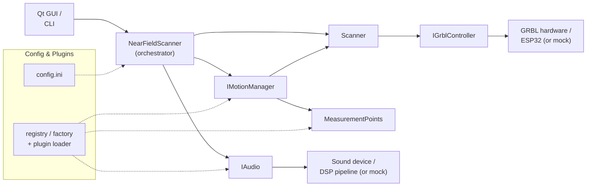
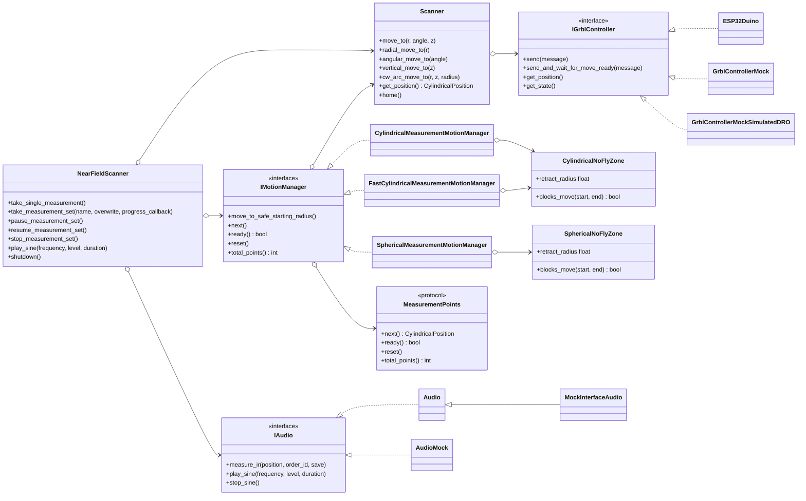
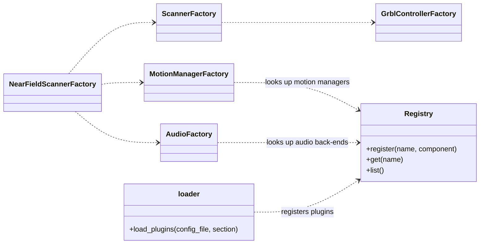
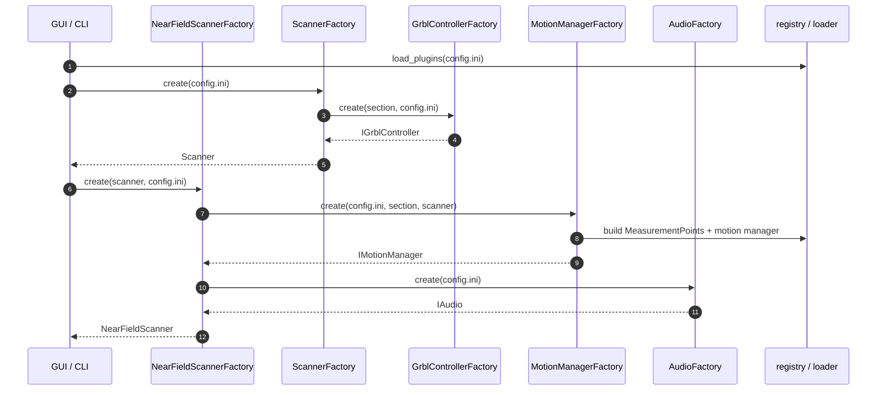
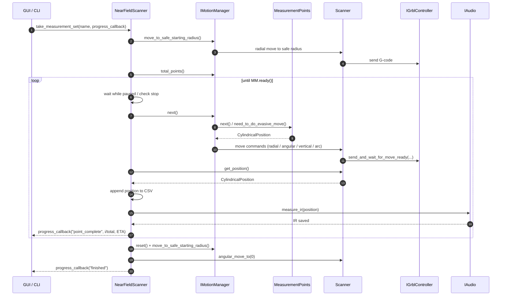
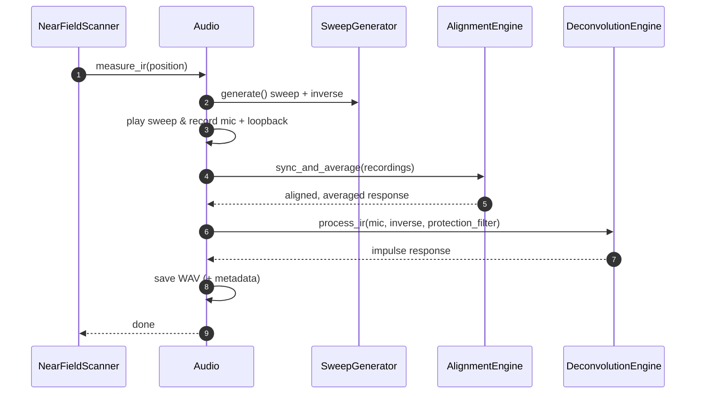

# Architecture Overview

This page describes how the Near Field Scanner (NFS) software is put together: the
main building blocks, how they depend on each other, and how they collaborate at
run time. It is meant as a *map* to read alongside the auto-generated
[API Reference](api.rst).

The diagrams are written in [Mermaid](https://mermaid.js.org/), which GitHub
renders natively when you view this file in the repository, and which the Sphinx
documentation site renders as well.

## The big picture

NFS drives a motorised arm (a GRBL-controlled machine) that moves a microphone to
a sequence of positions around a loudspeaker and, at every position, plays a sweep
and captures the impulse response (IR). Three concerns are kept strictly separate:

- **Where to measure** — the *measurement points* generators produce the ordered
  list of positions (cylindrical, spherical, file-based, ...).
- **How to move there safely** — the *motion managers* translate the next point
  into concrete, collision-free machine moves and delegate them to the scanner.
- **How to move and how to measure** — the *scanner* (motion) wraps the GRBL
  controller, and the *audio* subsystem plays the sweep and computes the IR.

The `NearFieldScanner` class is the orchestrator that ties these together, and a
set of *factories* build everything from `config.ini`. A small *plugin registry*
lets new generators, motion managers and audio back-ends be added without touching
the core.

## Components

| Component | Module | Responsibility |
|-----------|--------|----------------|
| `NearFieldScanner` | `nfs.nfs` | Orchestrates a full measurement run; owns the scanner, audio and motion manager; handles pausing/stopping, progress reporting and output directories. |
| `Scanner` | `nfs.scanner` | High-level, coordinate-aware motion API (radial/angular/vertical/arc moves) that hides raw G-code; wraps an `IGrblController`. |
| `IGrblController` | `nfs.grbl_controller` | Low-level GRBL transport. Real implementation `ESP32Duino`; `GrblControllerMock` / `GrblControllerMockSimulatedDRO` for tests and offline runs. |
| `IMotionManager` | `nfs.motion_manager` | Turns the next measurement point into safe machine moves. Variants: `CylindricalMeasurementMotionManager`, `FastCylindricalMeasurementMotionManager`, `SphericalMeasurementMotionManager`. |
| `MeasurementPoints` | `nfs.measurement_points` + `nfs.plugins.*` | Protocol producing the ordered sequence of positions to visit. Implemented by the point-generator plugins. |
| `IAudio` | `nfs.audio` | Plays the sweep, captures and computes the impulse response, and plays test sines. Real `Audio`, plus `MockInterfaceAudio` / `AudioMock`. |
| `registry` / `factory` / `loader` | `nfs.registry`, `nfs.factory`, `nfs.loader` | Plugin registration (measurement points, motion managers, audio) and dynamic loading via entry points / config. |
| `CylindricalPosition`, geometry/DSP utils | `nfs.datatypes`, `nfs.utils.*` | Shared value types and helper functions. |

## Class relationships

The following class diagram focuses on the structural relationships (interfaces,
implementations and ownership) rather than every method.

### Building the object graph (factories & plugins)

Everything is constructed from `config.ini` by dedicated factories, so the rest of
the code depends only on the interfaces above:

- `NearFieldScannerFactory.create()` wires the whole graph together.
- `ScannerFactory` / `GrblControllerFactory` build the motion stack.
- `MotionManagerFactory` builds the motion manager *and* its `MeasurementPoints`
  (via `nfs.factory.create`).
- `AudioFactory` builds the audio pipeline.

New generators, motion managers and audio back-ends are discovered through the
plugin `registry`, populated by `nfs.loader` from Python *entry points*
(see `pyproject.toml`) or from a config section. This is why adding a plugin
requires no changes to the core classes.

## Runtime behaviour

### Constructing a scanner

### Running a full measurement set

This is the core loop of `NearFieldScanner.take_measurement_set()`. The motion
manager decides *how* to reach each point safely (see
[Fast Cylindrical Motion Manager](fast_cylindrical_motion.md) for the fast path),
while the audio subsystem measures the IR once the arm is in position.

### Measuring an impulse response

At each point, `Audio.measure_ir()` runs the DSP pipeline: generate a sweep,
play/record it, align and average repeated sweeps, then deconvolve to obtain the
impulse response.

## Extending the system

To add a new **measurement-point generator**, implement the `MeasurementPoints`
protocol (`nfs.measurement_points`) and expose a `register(factory)` function,
then declare it under the `nfs.measurement_points` entry-point group in
`pyproject.toml` (existing plugins live in `src/nfs/plugins/`).

New **motion managers** implement `IMotionManager` and are registered under
`nfs.motion_managers`; new **audio back-ends** implement `IAudio` and are
registered under `nfs.audio`. Because the core depends only on these interfaces
and the factories, no orchestration code needs to change.
